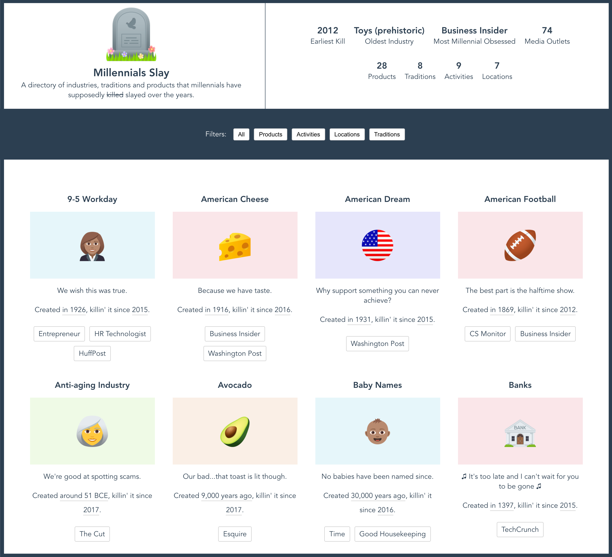
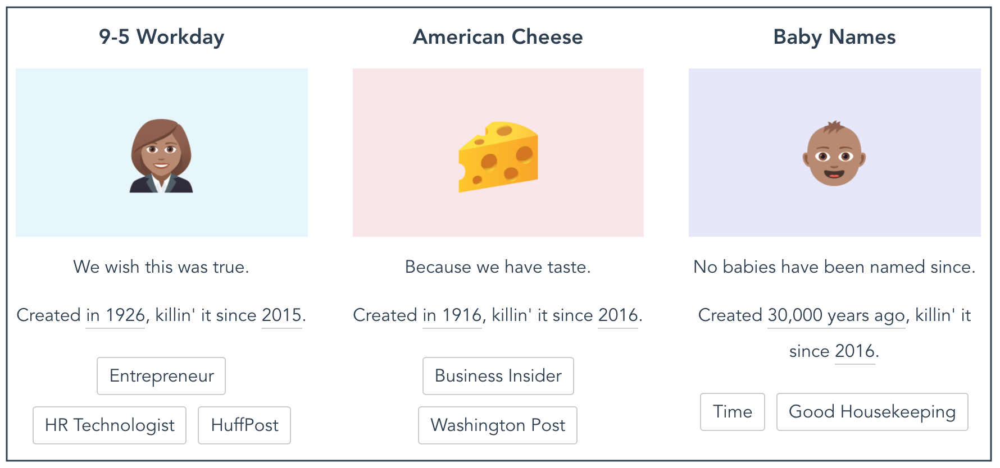

# Millennials Slay
## A directory of industries and traditions that millennials have 'killed' over the years.
[Visit millennialslay.lol](https://millennialslay.lol)



For almost 10 years now, stories about millennials killing various industries and products have circulated in the media. Spoiler alert: We haven't successfully killed any industries it seems. 🙃 

I found the articles to be super annoying so why not make a list and poke fun at them all? 

## Contributing Guidelines
Wanna add something to the list? Please do! If you need ideas, [check out this Issue](https://github.com/brittanyrw/millennials-slay/issues/18) where I have listed a bunch that I came across while working on the project.

### Adding a Card

Below is an example of what a card looks like on the website:

In the data file, each `Item Card` consists of the following object:



```
{
  name: "Baby Names",
  image: "baby-medium-skin-tone",
  type: "tradition",
  origin: {
    year: "30,000 years ago",
    link: "https://www.nationalgeographic.com/science/article/whos-the-first-person-in-history-whose-name-we-know",
  },
  summary: "No babies have been named since.",
  sources: [
    {
      name: "Time",
      year: 2016,
      link: "https://time.com/4511927/millennials-parents-baby-names/",
    }
  ],
}
```
