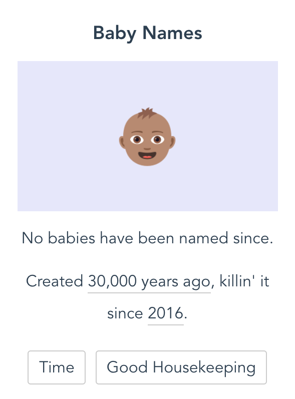

# Card Overview

Below is a detailed overview of how to add a `Card` to the project. Each card should be added to the `data.ts` file inside of the `industries` array as an object. 

### Please read through this before adding to this project.

On the website, each `Card` displays:

* The name of the item
* A single emoji image (the background color is generated by CSS)
* A sarcastic or funny one liner
* The origin year of the item and a link to a source for the origin
* The year the first source was published and a link to that article (this is automatically generated based on what sources you add)
* News sources for articles talking about millennials and the item



In the `data.ts` file each `Card` consists of the following object:

```
{
  name: "Baby Names",
  image: "baby-medium-skin-tone",
  type: "tradition",
  origin: {
    year: "30,000 years ago",
    link: "https://link-goes-here.com",
  },
  summary: "No babies have been named since.",
  sources: [
    {
      name: "Time",
      year: 2016,
      link: "https://link-goes-here.com",
    }
  ],
}
```

To add a new `Card` to the website, add a new object in the `data.ts` file insides of the `industries` array. Make sure to separate your new object from existing objects with a comma. Below is an overview of each key in the `Card` object. Every key is required.

### Name 👍

Each card must have a title. This should be the full title.

```
{
  title: "Beauty and the Beast",
}
```

### Image 😍

The emojis should be added to `emojiImgs` as a string. Your emojis should be surrounded by double quotation marks.

## **Important Note: Add five emojis maximum for each card**

```
{
  emojiImgs: "🏰🥀🎶📚🕰️",
}
```

### Type 🎬

Specify if the card you are adding is `tv`, `movie` or `musical`. Only add one type per card. 

`musical` under type is referring to live musicals performed on Broadway, the West End, local theaters etc. If you are adding a **movie** musical, please choose `movie` as the type and indicate it is a musical via genres.

```
{
  type: "movie",
}
```

### Origin 🔍

The genres should be added as an array (the square [] brackets indicates an array or list). Separate each genre with a comma and each genre should be wrapped in quotes and lowercase. If there are two words for a genre, replace the space with a hyphen (-). There is no limit to the number of genres but try not to add too many.

```
{
  genres: ["animation", "family", "action-adventure"],
}
```

For movies and TV shows, go to the IMDB profile and find the genres listed under the title. Add these genres to the `Emoji Card` object. Some cards will only have one genre, that is okay! Use the genre chart below as a guide for which genres are available.

See the below screenshot for the location of the genre listing in IMDB profiles.


For musicals, include the `musical` genre and any other genres from the list below that you think fit:

|         |           |           |           |        |         |             |       |
| ------- | --------- | --------- | --------- | ------ | ------- | ----------- | ----- |
| action  | adventure | animation | biography | comedy | crime   | documentary | drama |
| family  | fantasy   | film-noir | history   | horror | music   | mystery     | news  |
| romance | sci-fi    | sport     | thriller  | war    | western |             |       |
|         |           |           |           |        |         |             |       |

### Summary 🔗

For TV shows and movies, add the [IMDB page](https://www.imdb.com/) link.

For musicals link the [Playbill archive page](http://www.playbill.com/vault) for the show. Make sure the Playbill link is for the original production. It will say 'original' under the show name on Playbill. Here is an example of [the page you should be linking](http://www.playbill.com/production/les-miserables-broadway-theatre-vault-0000012257) for musicals.

Make sure the link includes `https` or `http` at the beginning. The link must be wrapped in quotation marks.

```
{
  itemLink: "https://www.imdb.com/title/tt0101414/",
}
```

### Sources 📆

Specify the year the movie or show was released or first aired. Or the first performance year for a musical. This should be a  single number (no quotations around the year). Do not add ranges such as 2017-2019. 

```
{
  year: 1994
}
```
