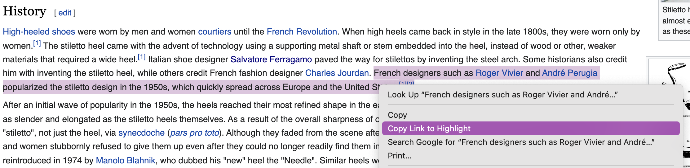

# Card Overview

Below is a detailed overview of how to add a `Card` to the project. Each card should be added to the `data.ts` file inside of the `industries` array as an object. 

### Please read through this before adding to this project.

On the website, each `Card` displays:

* The name of the item
* A single emoji image (the background color is generated by CSS)
* A sarcastic or funny one liner
* The origin year of the item and a link to a source for the origin
* The year the first source was published and a link to that article (this is automatically generated based on what sources you add)
* News sources for articles talking about millennials and the item

Here is an example of a `Card`.


In the `data.ts` file each `Card` consists of the following object:

```
{
  name: "Baby Names",
  image: "baby-medium-skin-tone",
  type: "tradition",
  origin: {
    year: "30,000 years ago",
    link: "https://link-goes-here.com",
  },
  summary: "No babies have been named since.",
  sources: [
    {
      name: "Time",
      year: 2016,
      link: "https://link-goes-here.com",
    }
  ],
}
```

To add a new `Card` to the website, add a new object in the `data.ts` file insides of the `industries` array. Make sure to separate your new object from existing objects with a comma. Below is an overview of each key in the `Card` object. Every key is required.

### Name 📣

Each card must have a name. This should be name of the product or industry. It should only be a few words long.

```
{
  title: "Baby Names",
}
```

### Image 📸

You can find images of available emojis to use inside of the `assets` folder. When adding a new `Card`, choose an image from the `emojis` folder. Move that image to the `emojis-in-use` folder for it to be used for the card. 

For the value of `image`, it should be a `string` that is the file name of the image (without .png).

## **Important Note: Add only one emoji**

```
{
  image: "baby-medium-skin-tone",
}
```

### Type 🎬

Specify if the card you are adding is a `product`, `activity`, `location` or `tradition`. Only add one type per card. 

```
{
  type: "tradition",
}
```

### Origin 🔍

For `origin`, look up the origin or original date of the item you are adding. Some of them are easier (such as when the first film was created) but some of them are not as straightforward. For example, for `Baby Names` I put the oldest example of the concept of names in general.

So use your best judgement and try to find a source (Wikipedia is great) for when the item came about. Try to find a specific year but if you can't then things like "1950s" or "19th century" works.

The `year` should be a string of text. This will be inserted in a sentence that reads 'Created `[year goes here]`, killin' it since _____'. So make sure to add `in` or `years ago` or `in the`, etc to your string so the sentence makes sense. 

Examples:
* 1953: `"in 1953"`
* 19th century: `"in the 19th century"`
* 30,000: `"30,000 years ago"`

The `link` should be a `string` that is a URL (please make sure to include https/http). 

Also please include the highlight link if you are able. Highlight the source and right click to copy the highlight link.



```
origin: {
  year: "30,000 years ago",
  link: "https://link-goes-here.com",
}
```

### Summary 📓

The `summary` should be a short, sarcastic or funny one-liner about the item. It could be why millennials are being blamed, a joke, etc. Bonus points if you use millennial specific slang or pop culture references. 😉

```
{
  summary: "No babies have been named since.",
}
```

### Sources 📰
`Sources` is an array of objects. Each object is an individual source for the item. 

Find at least one article talking about millennials killing/ruining/ending the item. Preferably you can add 2 - 5 sources. Avoid using tabloids or super political websites. 

Each source object has the `name` of the media organization, the `year` the article was published and a `url` to the actual article.

Duplicate the object to add multiple sources.

In the `data.ts` file, there is a `Media` TypeScript type listing all of the news companies already used. Please use that version of the news company name and add in any new ones that you find.

Example: If your article is from the `Wall Street Journal`, you need to use `Wall Street Journal` as defined in the Media type and not `WSJ` or `The Wall Street Journal`.

```
  sources: [
    {
      name: "Time",
      year: 2016,
      link: "https://link-goes-here.com",
    }
  ]
```
